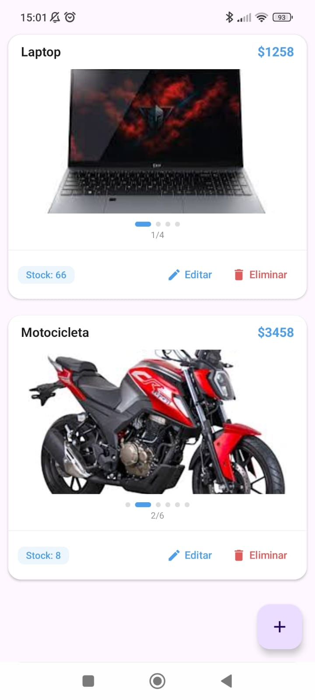
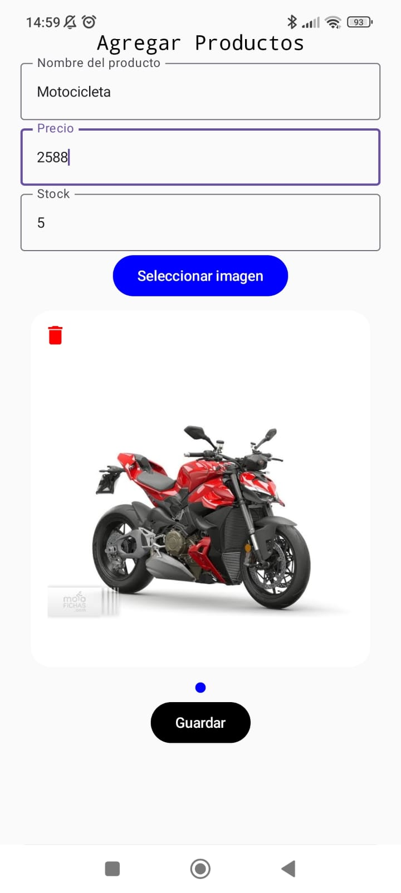
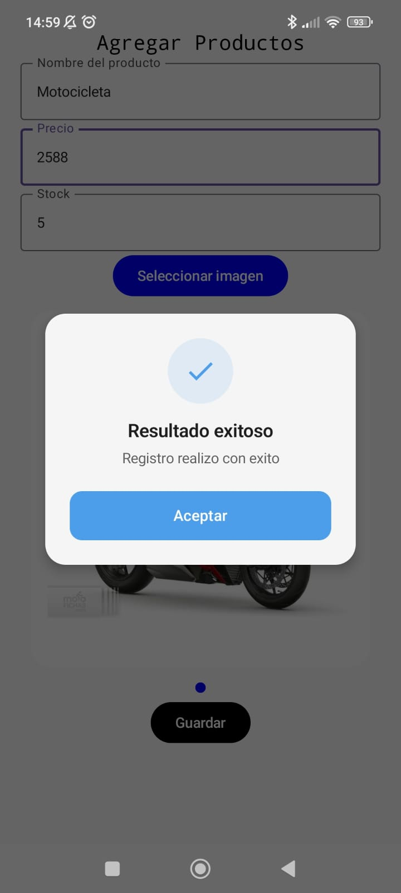
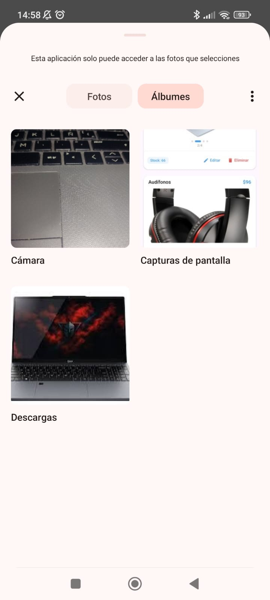
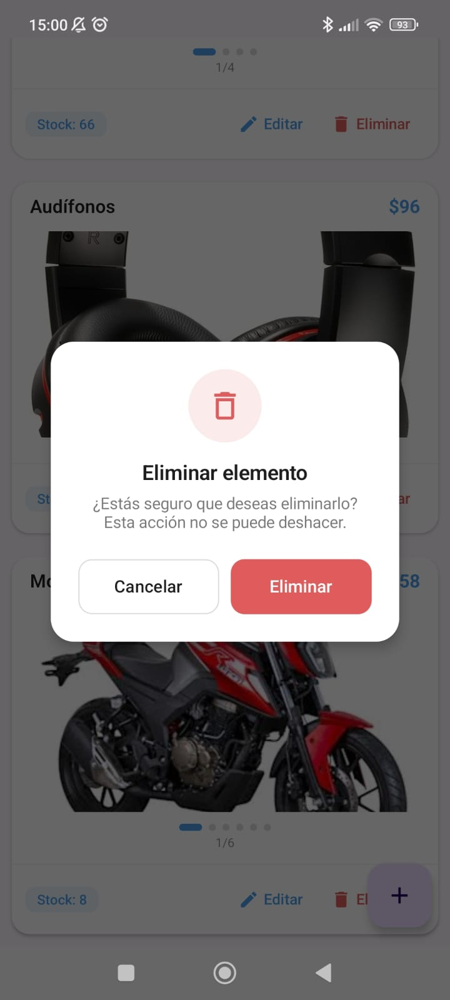

<h1 style="text-align: center;"> No te compares con otros programadores. Compárate con el programador que eras ayer y celebra tu progreso continuo🥇</h1>	

 
   

¿Buscas iconos? 💙📁🔧🔑💻🎁💾🎉💀   👉 <b><a href="https://gist.github.com/rxaviers/7360908" style="text-decoration: none;">
 Ingresa aqui</a></b> 👈

>[!NOTE]
> 
  <h2 style="margin-left: 10px;"> Android Studio + Jetpack Compose</h2>

>[!TIP]
>
Aplicación realizada en clase 

> <h2>App Gneral</h2>
> 
Descarga la aplicación <a href="https://github.com/DarwinChamba/CrudProductos/releases/tag/v1.0.0" target="_blank">aquí</a>

>  

   

> [!NOTE]
> ## Tecnologías utilizadas 📱
>
> **🗂️ Supabase Storage**
>
> Se utilizó **Supabase Storage** para almacenar las imágenes de los productos. Posteriormente, se obtiene la **URL pública** de cada imagen para guardarla en la base de datos y mostrarla dentro de la aplicación.
>
> **🔥 Firebase Realtime Database**
>
> La información de los productos se almacena en **Firebase Realtime Database**, lo que permite sincronizar los datos en tiempo real. De esta manera, cuando un usuario agrega, edita o elimina un producto, los cambios se reflejan automáticamente en todos los dispositivos que utilizan la aplicación.
>
> **🏗️ Arquitectura MVVM**
>
> El proyecto está desarrollado siguiendo la arquitectura **MVVM (Model–View–ViewModel)**, con el objetivo de mantener una estructura organizada, facilitar el mantenimiento del código y permitir el desarrollo de aplicaciones escalables y robustas.

> [!IMPORTANT]
> ## Imágenes del Proyecto
>
> 

>   
>   
>   
>   
>   
> 

